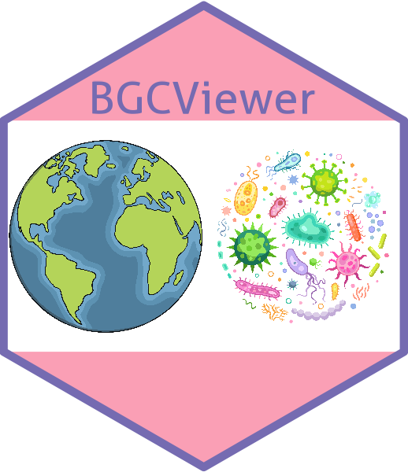

# CloudChart

<div align="center">
  
</div>

A Shiny visualization platform for the **Biogeochemistry Group** of the Institute of
Applied Ecology, Chinese Academy of Sciences. CloudChart turns common biogeochemical
data analysis tasks (plotting, dimension reduction, statistics, data wrangling) into
point-and-click workflows.

## Architecture

CloudChart ships as a **portal hub + independent sub apps**, not as one monolithic Shiny
app. Each sub app boots only the packages and modules it needs, so startup stays fast
and future work stays contained.

```
CloudChart/
├── app.R                    # Portal hub (lightweight, default entrypoint)
├── apps/
│   ├── core_plots/          # dot, bubble, bar, line, box, violin, pie, heatmap ...
│   ├── advanced_plots/      # PCA, PCoA, t-SNE, UMAP, RDA, volcano, correlation
│   ├── statistics/          # t-test, ANOVA, regression, survival, effect size ...
│   └── data_tools/          # filter, select, summarize, pivot, missing, sort ...
├── R/
│   ├── core/                # Bootstrap, factory, specs, layout chrome
│   ├── shared/              # Upload / download / helpers / stats & data-tools shells
│   └── modules/
│       ├── core/            # Basic plot module pairs (18 plots × 2 files)
│       ├── advanced/        # Advanced plot module pairs (7 plots × 2 files)
│       ├── statistics/      # Statistical test module pairs (13 modules × 2 files)
│       └── data_tools/      # Data wrangling module pairs (6 modules × 2 files)
├── www/                     # Static assets
├── data/                    # Example datasets
└── legacy/                  # Pre-refactor monolithic snapshot (do not use)
```

The **portal hub** is a thin landing page that points users at each sub app. It
intentionally does NOT load any plotting dependencies, so the hub itself starts
in well under a second.

Each sub app is just an `app.R` file that:

1. Sources `R/app_bootstrap.R`
2. Calls `bgc_bootstrap(root_dir, groups = "<group_name>")` to load only the
   packages and modules that group needs
3. Builds its UI/server through `bgc_plot_app_ui()` / `bgc_plot_app_server()`

## Modules at a glance

| Group | What it covers |
|---|---|
| **Core Plots** (19) | Dot, Bubble, Bar, Line, Box, Smooth Line, Violin, Pie, Donut, Density, Density+Histogram, Histogram, Ridgeline, Lollipop, Radar, Heatmap, Stacked Area, Waterfall, Dumbbell |
| **Advanced Plots** (10) | PCA, PCoA, t-SNE, UMAP, RDA, Volcano, Correlation Matrix, Sankey / Alluvial, Treemap, Dendrogram |
| **Statistics** (13) | t-test, One-way ANOVA, Correlation, Linear Regression, Wilcoxon, Chi-square, Kruskal–Wallis, Fisher's Exact, Shapiro–Wilk, **Post-hoc Tests** (Tukey / pairwise t / pairwise Wilcoxon), **Logistic Regression** (OR + CI + McFadden R²), **Survival (Kaplan–Meier + log-rank)**, **Effect Size** (Cohen's d / η² / Cramér's V) |
| **Data Tools** (10) | Filter Rows, Select / Rename, Summarize, Missing Values, Pivot Wider/Longer, Sort / Distinct, Mutate / Cast, Join Tables, Group & Aggregate, Export |

Each statistics module shares the same `Example Data → Data & Parameters → Results`
tab layout with a one-click **Run Analysis** button, printable summary, results table,
and CSV download.

## Running

From the project root:

```r
# Hub (recommended starting point)
shiny::runApp(".")

# Or any single sub app directly
shiny::runApp("apps/core_plots")
shiny::runApp("apps/advanced_plots")
shiny::runApp("apps/statistics")
shiny::runApp("apps/data_tools")
```

## Adding a new plot / statistics / data tool module

1. Create a module **pair** under `R/modules/<group>/`:
   - `module_<name>_parameters.R` — the parameter UI (returns a `fluidPage`)
   - `module_<name>.R` — the `moduleServer` implementation
2. Register the module in `R/core/app_specs.R` under the matching group inside
   `bgc_plot_specs`. For statistics and data-tools modules, set
   `layout = "stats"` or `layout = "data_tools"` so the factory picks the right
   tab shell (`basic_stats_UI` / `basic_data_tools_UI`).
3. List both files in `bgc_module_files` so the bootstrap loader can find them.
4. (Optional) Declare any extra packages it needs in `bgc_group_packages`.

Statistics modules should render results through `bind_stats_outputs(output, input,
print_fn, table_fn, filename_prefix)` (defined in `R/shared/basic_stats_UI.R`).
That gives every module a consistent summary pane, table pane, and CSV download
for free.

No edit to the factory, sidebar, or tab wiring is required — `app_factory.R`
will pick up the new spec automatically.

## Adding a new sub app (new domain)

1. Copy `apps/app_template.R` into `apps/<your_domain>/app.R`.
2. Pick a `group_name` and add it to `bgc_plot_specs`, `bgc_group_menu_config`,
   `bgc_module_files`, and `bgc_group_packages` in `R/core/app_specs.R`.
3. Add the modules under `R/`.

## Screenshots

UI captures live in [`docs/screenshots/`](docs/screenshots/README.md).
Each sub app keeps its own set of images using the
`<sub_app>__<module_id>.png` convention, and the folder README has a short
capture checklist.

<!-- Example placeholder — replace once screenshots are in.


-->

## Changelog

See [`CHANGELOG.md`](CHANGELOG.md) for the full release history. Recent
changes include the **Post-hoc Tests**, **Logistic Regression**,
**Survival (Kaplan–Meier)** and **Effect Size** statistics modules.

## Status

The refactor from the original monolithic dashboard into the hub + sub app
architecture above is complete for the four current domains (core plots,
advanced plots, statistics, data tools). The legacy entrypoint
(`legacy/app_2.R`) is kept for reference only; do not run it.

## Affiliation

Biogeochemistry Group · Institute of Applied Ecology · Chinese Academy of Sciences
[http://www.iae.cas.cn/biogeochemistry/](http://www.iae.cas.cn/biogeochemistry/)
